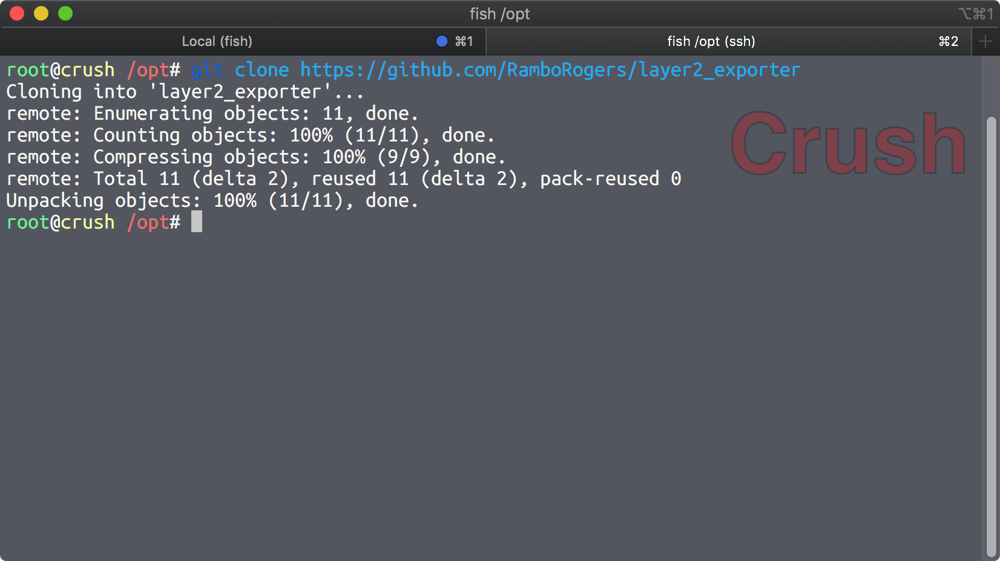
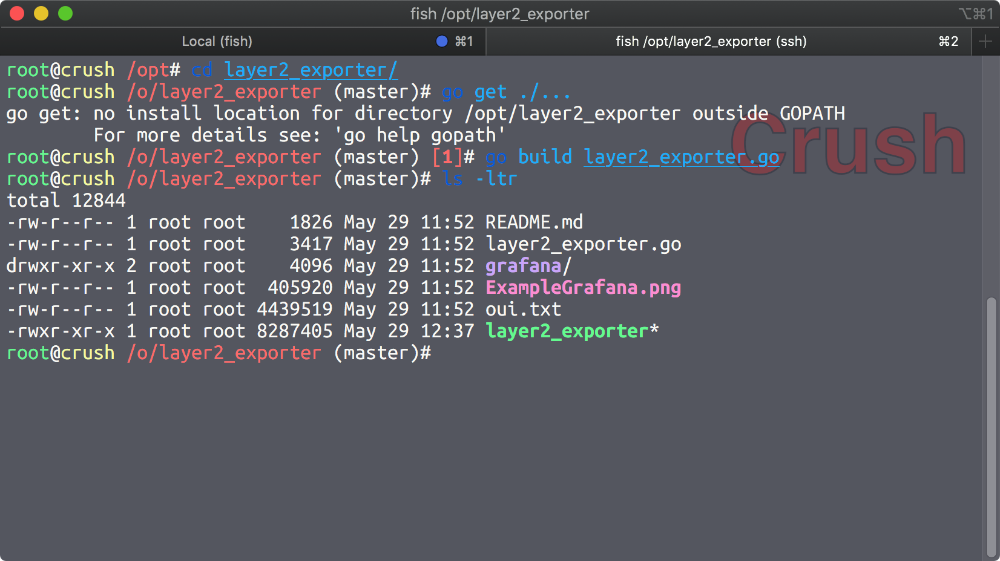
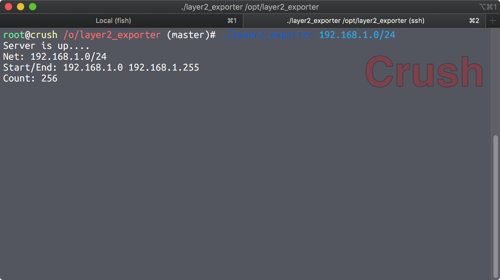
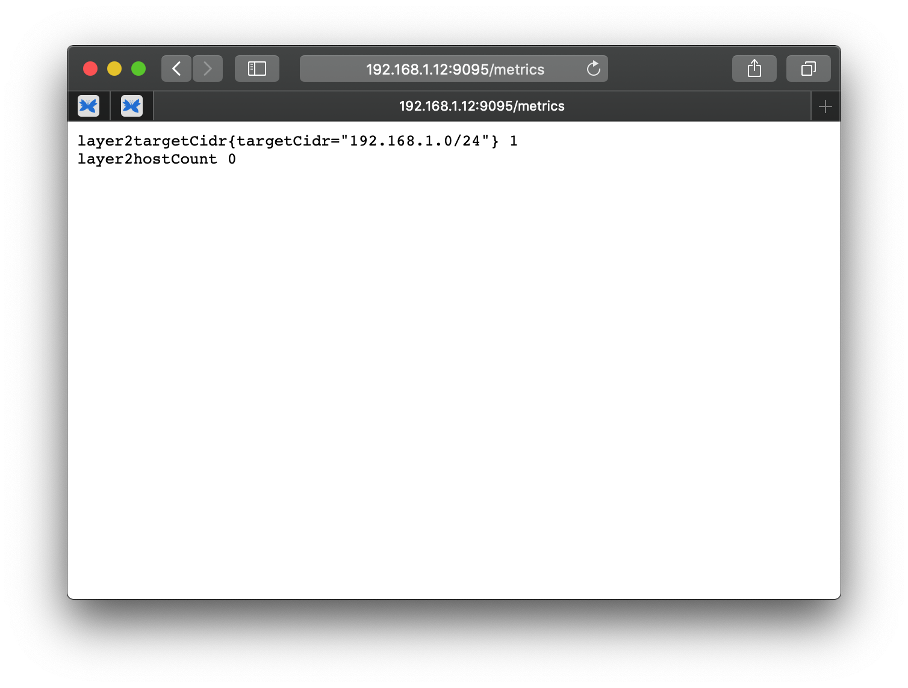
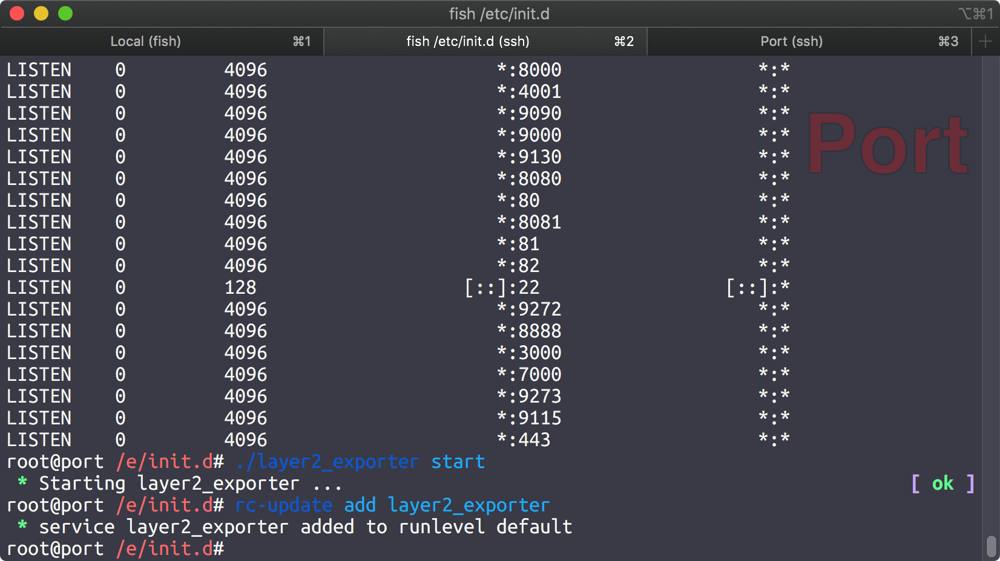

# Layer2_Exporter Alpine Install Guide
This a quick install guide for Alpine linux.

# Buy me a coffee
If you feel so inclined as to support my projects. Here's your chance! Thanks 

<a href="https://www.buymeacoffee.com/matthewrogers" target="_blank"></a>

# Download the Code
I put this in /opt because on this host I have all my hosted applications running under /opt.  You could also use your gopath or whatever makes you happy.
### Commands
```bash
git clone https://github.com/RamboRogers/layer2_exporter
```
### Screen Capture


# Compile the Code
Compiling is pretty simple.  Go really makes this process easy.

### Commands
```bash
cd layer2_exporter
go get ./...
go build layer2_exporter.go
```

### Screen Capture
We can see of lovely executable code here as the output. 


You can test it like this.


Then verify the metrics pages is up. This will populate once a scan is done,  *1 minute for a /24*.


# Service Creation

Example Service file for /etc/init.d/layer2_exporter
```bash
#!/sbin/openrc-run

name="layer2_exporter"
directory="/opt/layer2_exporter"
command="/opt/layer2_exporter/layer2_exporter"
command_args="192.168.1.0/24"
pidfile="/run/layer2_exporter.pid"
command_background="yes"
command_user=root
output_log="/var/log/layer2_exporter.log"
```

Start it up, and enable the service to start.
```bash
rc-service layer2_exporter start
rc-update add layer2_exporter
```

### Screen Capture


# Homepage / Contact
My homepage and contact info. 

| Type  | Data
| ----- | --------
| Homepage | <https://matthewrogers.org> |
| XMPP | RamboRogers@trashserver.net |

# FIN
Thanks for reading.