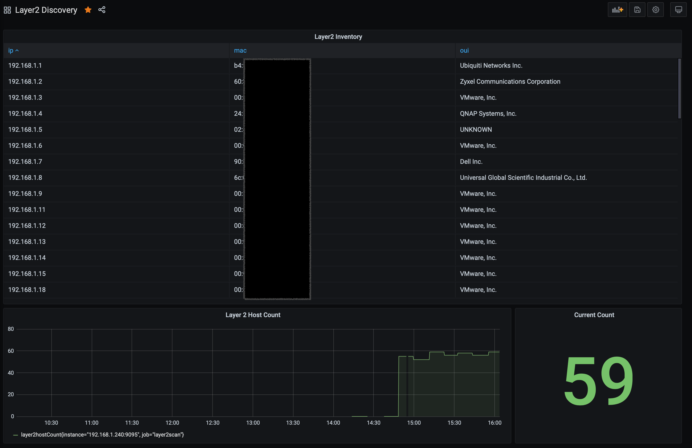

# layer2_exporter

Layer2_exporter is a [Prometheus](https://prometheus.io) exporter with layer2 network scanning.  This a not your regular network inventory, it detects devices that are silent and do not respond to pings or scans. It's written in go, and works on Linux/MacOS.

# Buy me a coffee
If you feel so inclined as to support my projects. Here's your chance! Thanks 

<a href="https://www.buymeacoffee.com/matthewrogers" target="_blank"></a>

# Installation

Use go to install to your gopath.

```bash
go get -u github.com/RamboRogers/layer2_exporter 
```
**Alpine Server Install Instructions:** [INSTALL_ALPINE.md](./INSTALL_ALPINE.md)

# Usage
Compile using go, and execute with a CIDR block to begin scanning.  Scanning a /24 takes about 10-15 minutes. Scans will continue on a cycle forever. 

The default metrics port is TCP/HTTP 9095.  If running locally [127.0.0.1:9095/metrics](127.0.0.1:9095/metrics)
```bash
#BUILDING
cd ~/go/src/RamboRogers/layer2_exporter
go build

#RUNNING
./layer2_exporter 192.168.1.0/24

#RUN ON CUSTOM PORT
./layer2_exporter 192.168.1.0/24 :9999

#RUN ON LOCAL INTERFACE
./layer2_exporter 192.168.1.0/24 127.0.0.1:9999
```
# Prometheus Setup
Setting up in your Prometheus is easy. Just use this example, append to your existing Prometheus config and adjust the target to match where your exporter is running.

```bash
- job_name: layer2scan
  scrape_interval: 60s
  metrics_path: /metrics
  static_configs:
    - targets:
       - 192.168.1.240:9095
```


# Grafana Dashboard
Here is an example dashboard. You can import to your Grafana. This was made on Grafana version 7.
>

[Download Dashboard](grafana/Layer2Discovery-Example.json)

# Contributing
Pull requests are welcome. For major changes, please open an issue first to discuss what you would like to change.

# Homepage
My homepage and contact info. Hello I'm Matthew Rogers!
[https://matthewrogers.org/en/Layer2Exporter](https://matthewrogers.org/en/Layer2Exporter)

# License
[GPL-3](https://choosealicense.com/licenses/gpl-3.0/)